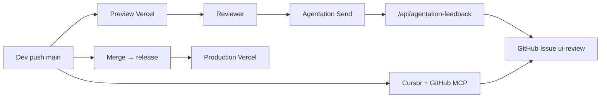

# Deploy na Vercel — dwa środowiska (klient vs zespół)

> **Pełna dokumentacja:** [GitHub Wiki](https://github.com/bronisMateusz/Demo-Elements/wiki) (źródło: folder [`wiki/`](../wiki/))

Hosting: **Vercel** (frontend + API). GitHub Pages jest wyłączone — deploy robi Vercel po pushu.

## Model

| Środowisko | Branch Vercel | Env w panelu | Agentation | Auto-issue GitHub |
|------------|---------------|--------------|------------|-------------------|
| **Klient** | `release` → Production | Production | wyłączone | — |
| **Zespół** | `main` → Preview | Preview | zawsze włączone | Send → `/api/agentation-feedback` |

Klient widuje stabilny kod z `release`. Zespół pracuje na `main` z pełnym review (pinezki + automatyczne issue).

## Konfiguracja projektu Vercel

1. Połącz repo `Demo-Elements` z Vercel.
2. **Settings → Git → Production Branch** → ustaw na `release` (nie `main`).
3. **Settings → Environment Variables → Import .env** — importuj pliki z folderu [`env/`](../env/README.md):

| Plik | Scope przy imporcie |
|------|---------------------|
| `env/vercel.shared.env` | Production and Preview |
| `env/vercel.production.env` | Production |
| `env/vercel.preview.env` | Preview |

Po imporcie `vercel.shared.env` podmień `GITHUB_TOKEN` na prawdziwy PAT. Po pierwszym deployu `main` zaktualizuj `ALLOWED_ORIGINS` na URL preview z Vercel.

Alternatywnie — ręcznie w panelu:

### Wspólne (Production + Preview)

| Zmienna | Wartość |
|---------|---------|
| `GITHUB_TOKEN` | PAT: Issues + Contents (write) |
| `GITHUB_REPO` | `bronisMateusz/Demo-Elements` |
| `ALLOWED_ORIGINS` | URL preview zespołu + localhost, np. `https://demo-elements-xxx.vercel.app,http://localhost:5173` |

### Production (klient — branch `release`)

| Zmienna | Wartość |
|---------|---------|
| `VITE_DEPLOY_TARGET` | `client` |
| `VITE_AGENTATION_ENABLED` | `false` |

### Preview (zespół — branch `main` i inne)

| Zmienna | Wartość |
|---------|---------|
| `VITE_DEPLOY_TARGET` | `team` |
| `VITE_AGENTATION_ENABLED` | `true` |
| `VITE_AGENTATION_WEBHOOK_URL` | `/api/agentation-feedback` |

4. **Domains** (opcjonalnie):
   - Production → np. `elements.klient.pl` (branch `release`)
   - Preview alias dla `main` → np. `elements-team.vercel.app` (Vercel → Domains → assign to branch)

## Workflow zespołu



1. Reviewer otwiera URL preview (main).
2. Zostawia pinezki w Agentation → **Send** (strzałka) → auto-issue na GitHub.
3. Issue z etykietą `ui-review` pojawia się w repo.
4. Dev w Cursorze czyta issue (GitHub MCP) i wdraża poprawki.
5. Po akceptacji klienta: merge `main` → `release` → production deploy bez Agentation.

## Lokalny development

```bash
# Zwykły dev (Agentation: ?review=1 lub ?agentation=1)
npm run dev

# Dev jak środowisko zespołu (Agentation zawsze + API przez vercel dev)
cp .env.example .env.local
# ustaw VITE_DEPLOY_TARGET=team i VITE_AGENTATION_ENABLED=true
npx vercel dev
```

Build lokalny:

```bash
npm run build:team    # jak preview zespołu
npm run build:client  # jak production klienta
```

## API — auto-issue

Endpoint: `POST /api/agentation-feedback`

Obsługuje webhook Agentation (`event: "submit"`) i tworzy issue z pełnym markdownem.

Token GitHub **nigdy** nie trafia do przeglądarki — tylko Vercel serverless.

## GitHub Actions

Workflow `.github/workflows/ci.yml` uruchamia lint + build dla obu targetów (`team` / `client`). Deploy robi Vercel, nie Actions.

## Wyłączenie GitHub Pages

W repo GitHub: **Settings → Pages → Source: None** (jeśli było włączone).
